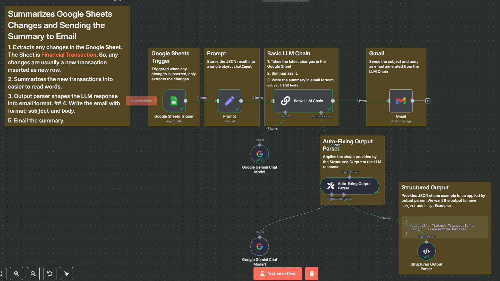
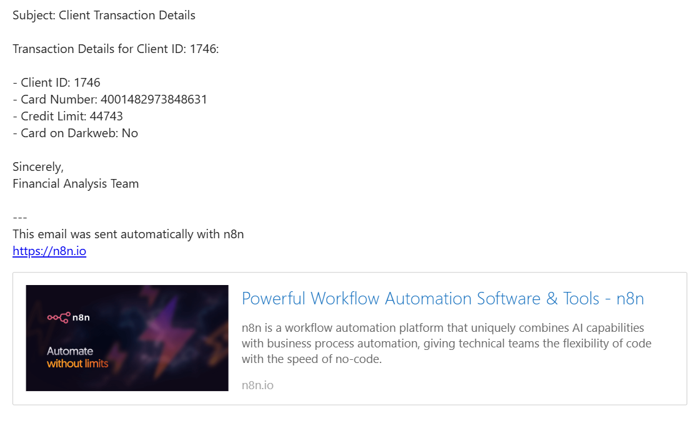

# AI-Agent-in-n8n

## Workflow:

## 1. Objectives

### 1.1. Extracts the new transactions from the Google Sheets

### 1.2. Summarizes them into easier to read sentences

### 1.3 Write the summary into email format

### 1.4 Email the summary

## 2. Requirements to run this workflow

Refer to this [link](https://docs.n8n.io/integrations/builtin/credentials/google/#compatible-nodes)

### 2.1 Upload this dataset into your Google Drive [Financial Transactions Dataset](https://www.kaggle.com/datasets/computingvictor/transactions-fraud-datasets)

### 2.2 Enable Google Sheets API and Gmail API in Google Cloud account

### 2.3 Setup OAuth Credentials, put the Client ID and Client Secret into the Google Sheets and Gmail nodes

### 2.4 Get API keys for your AI model (I use Gemini), put the key into Gemini node

### 2.5 Run

## Result

